# Dragon's Lair - Central IT Agency Org Chart

```mermaid
graph TD
    CIO["CIO<br/>Dragon's Lair IT"]

    CIO --> INFRA["VP Infrastructure<br/>& Operations"]
    CIO --> SAFETY["VP Safety Systems<br/>& OT"]
    CIO --> APPS["VP Applications<br/>& Guest Experience"]
    CIO --> DATA["VP Data<br/>& Intelligence"]
    CIO --> BIZ["VP Business<br/>Systems"]
    CIO --> SEC["CISO<br/>Cybersecurity"]

    %% Infrastructure & Operations
    INFRA --> DCO["Data Center<br/>& Cloud Ops"]
    INFRA --> NETOPS["Network<br/>Operations"]
    INFRA --> IAM["Identity & Access<br/>Management"]
    INFRA --> ITSM["IT Service<br/>Management"]

    %% Safety Systems & OT
    SAFETY --> SCADA["SCADA / OT<br/>Containment Systems"]
    SAFETY --> IOT["IoT & Sensor<br/>Engineering"]
    SAFETY --> EMERGENCY["Emergency<br/>Systems"]
    SAFETY --> COMMS["Communications<br/>& Radio"]
    SAFETY --> DRONES["Drone &<br/>Robotics"]

    %% Applications & Guest Experience
    APPS --> APPDEV["Application<br/>Development"]
    APPS --> DIGX["Digital Signage<br/>& AV"]
    APPS --> ECOM["E-Commerce<br/>& POS"]
    APPS --> VETTECH["Veterinary Tech<br/>Systems"]

    %% Data & Intelligence
    DATA --> BI["Data Analytics<br/>& BI"]
    DATA --> AIML["AI / ML<br/>Engineering"]
    DATA --> GIS["GIS &<br/>Mapping"]

    %% Business Systems
    BIZ --> ERP["ERP &<br/>Finance IT"]
    BIZ --> HR["HR & Workforce<br/>Management"]
    BIZ --> COMPLY["Compliance &<br/>Regulatory IT"]

    %% Cybersecurity
    SEC --> SECOPS["Security<br/>Operations"]
    SEC --> APPSEC["Application<br/>Security"]
    SEC --> OTSEC["OT Security"]

    %% Styling
    classDef exec fill:#1a1a2e,stroke:#e94560,color:#ffffff
    classDef vp fill:#16213e,stroke:#0f3460,color:#ffffff
    classDef team fill:#0f3460,stroke:#533483,color:#ffffff
    classDef safety fill:#b80000,stroke:#e94560,color:#ffffff

    class CIO exec
    class INFRA,APPS,DATA,BIZ,SEC vp
    class DCO,NETOPS,IAM,ITSM,APPDEV,DIGX,ECOM,VETTECH,BI,AIML,GIS,ERP,HR,COMPLY,SECOPS,APPSEC,OTSEC team
    class SAFETY safety
    class SCADA,IOT,EMERGENCY,COMMS,DRONES safety
```

## Key Notes

- **Safety Systems & OT** (highlighted in red) is separated from general Infrastructure due to the life-safety criticality of dragon containment. This team has its own change management process and escalation path.
- **OT Security** sits under the CISO but works in close partnership with the VP Safety Systems to ensure containment systems are hardened without impacting response times.
- **Data Center & Cloud Ops** manages all servers across both tiers (life-safety and business), but containment system changes require sign-off from the VP Safety Systems.
- **Veterinary Tech Systems** sits under Applications since it's primarily a software/records system, but interfaces heavily with IoT/Sensor Engineering for real-time dragon biometrics.
